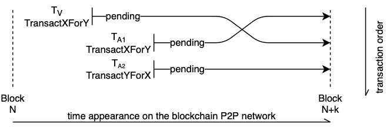
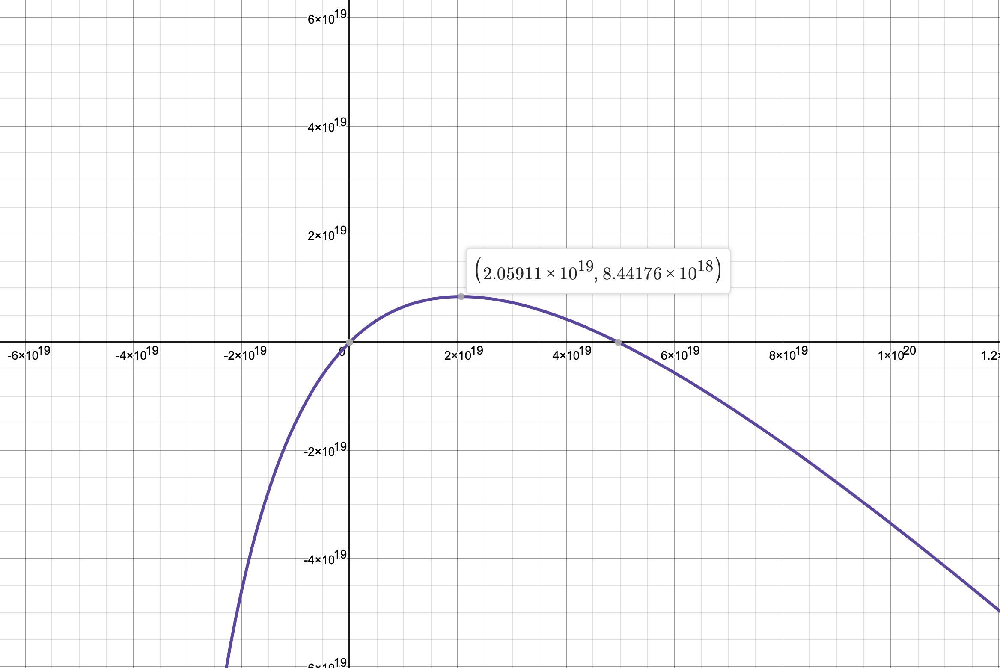
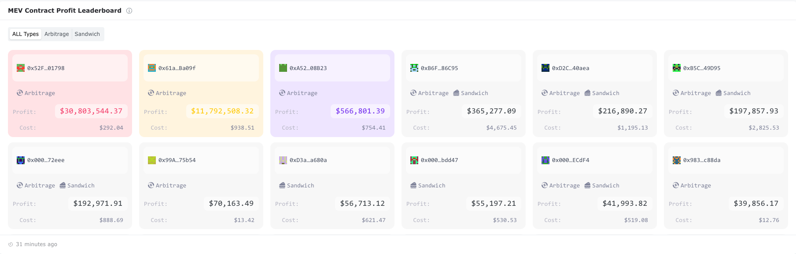
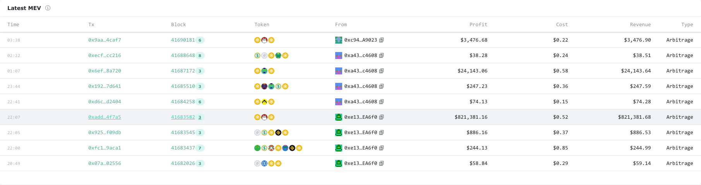
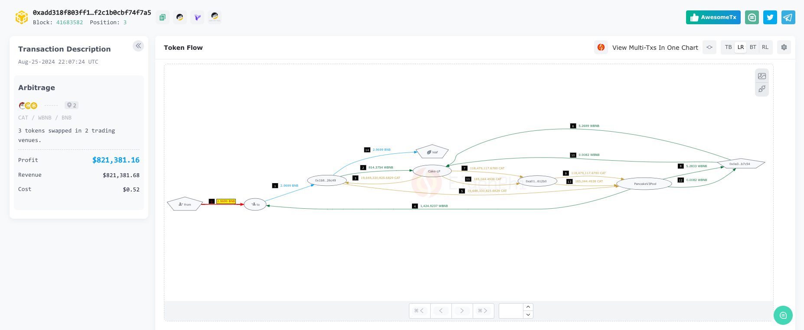
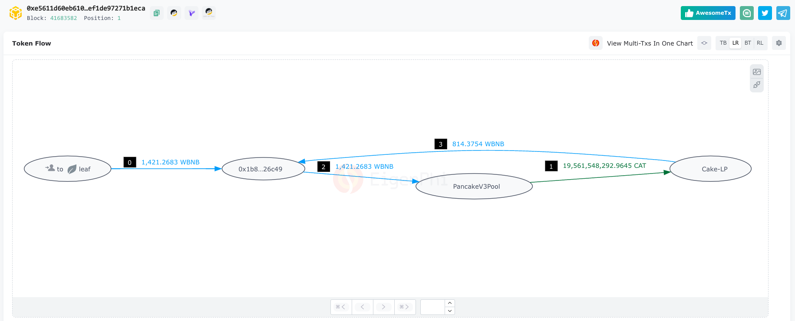
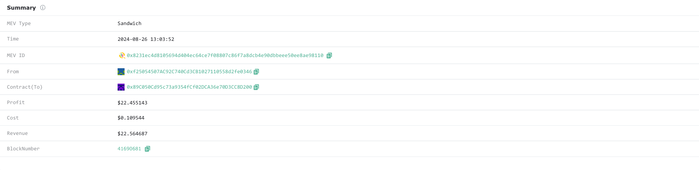
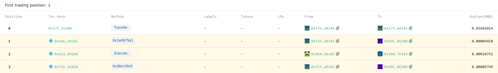
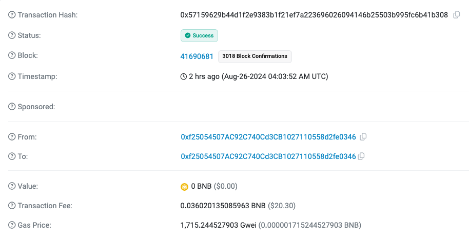

# MEV Attack on the BSC

<h4 align="center">
    

                <a href="https://github.com/DonggeunYu/MEV-Attack-on-the-BSC/blob/main/README.md">English</a> |
                <b>한국어</b>
    

</h4>

## Overview
- 이 레포지토리는 BSC(Binance Smart Chain) 네트워크에서 DEX(Decentralized Exchange)를 대상으로 한 MEV(Maximal Extractable Value) 공격을 통해 이익을 창출하는 방안을 구현한 것입니다.
- MEV 개발은 금전적 이익과 직결되기 때문에, 실질적으로 도움이 되는 자료를 찾기가 쉽지 않습니다. 이 자료가 여러 개발자들에게 영감을 제공하고, 그들의 프로젝트에 실질적인 가치를 더할 수 있기를 바랍니다.
- 이 프로젝트는 2024년 1월부터 2024년 5월까지 개발 및 운영되었습니다.
- 기술적 문의와 피드백은 레포지토리의 Issue 페이지를 이용해 주시고, 그 외의 문의는 ddonggeunn@gmail.com으로 연락해 주시기 바랍니다.

 
 
 

## Content
- [MEV Attack Bot on BSC](#mev-attack-bot-on-bsc)
  * [Overview](#overview)
  * [Content](#content)
  * [Transaction Sample for Sandwich Attack](#transaction-sample-for-sandwich-attack)
    + [Sandwich Attack used bloXroute](#sandwich-attack-used-bloxroute)
    + [Sandwich Attack used 48 Club](#sandwich-attack-used-48-club)
    + [Sandwich Attack used General](#sandwich-attack-used-general)
  * [Theoretical Explanation of MEV](#theoretical-explanation-of-mev)
    + [Acronym](#acronym)
    + [The Ideal Flow of the Expected Blockchain](#the-ideal-flow-of-the-expected-blockchain)
    + [Vulnerabilities of DEX Swap](#vulnerabilities-of-dex-swap)
    + [How to Protect from MEV Attacker](#how-to-protect-from-mev-attacker)
      - [Are the Block Proposer and Builder Separated?](#are-the-block-proposer-and-builder-separated-)
  * [Detailed Explanation of Source Code and Formulas](#detailed-explanation-of-source-code-and-formulas)
    + [Project Structure](#project-structure)
      - [Directory Structure](#directory-structure)
    + [IAC Tips](#iac-tips)
    + [About MEV-Relay](#about-mev-relay)
    + [Explain the Solidity Code](#explain-the-solidity-code)
      - [What is the difference between sandwichFrontRun and sandwichFrontRunDifficult?](#what-is-the-difference-between-sandwichfrontrun-and-sandwichfrontrundifficult-)
      - [About the BackRun Function](#about-the-backrun-function)
      - [Swap Router](#swap-router)
      - [Supported DEX List](#supported-dex-list)
      - [Solidity Test Code](#solidity-test-code)
    + [Explain the Python Code](#explain-the-python-code)
      - [Important Note](#important-note)
      - [Explain the Process in Writing](#explain-the-process-in-writing)
      - [Why is Arbitrage Only Used for General Path?](#why-is-arbitrage-only-used-for-general-path-)
      - [Trace Transaction](#trace-transaction)
    + [Formula Parts](#formula-parts)
      - [Reasons Why Understanding DEX AMM is Important](#reasons-why-understanding-dex-amm-is-important)
      - [Structure of Uniswap V2, V3](#structure-of-uniswap-v2--v3)
      - [Optimize the Uniswap V2 Swap to the Extreme](#optimize-the-uniswap-v2-swap-to-the-extreme)
        * [1. Uniswap V2 Amount Out Formula](#1-uniswap-v2-amount-out-formula)
        * [2. Analyze Uniswap V2 Swap](#2-analyze-uniswap-v2-swap)
        * [3. Optimization of Swap Formula](#3-optimization-of-swap-formula)
        * [4. Verification of the Formula Optimized to the Extreme](#4-verification-of-the-formula-optimized-to-the-extreme)
      - [Multi-hop Arbitrage Formula](#multi-hop-arbitrage-formula)
        * [1. 2-hop Arbitrage Formula](#1-2-hop-arbitrage-formula)
        * [2. Multi-hop Arbitrage Formula](#2-multi-hop-arbitrage-formula)
  * [EigenPhi is Overhyped](#eigenphi-is-overhyped)
    + [When Sandwich is Recognized as Arbitrage](#when-sandwich-is-recognized-as-arbitrage)
    + [When Doing Sandwich Using 48 Club](#when-doing-sandwich-using-48-club)
  * [Frequently Asked Questions](#frequently-asked-questions)
      - [Why you select the BSC network?](#why-you-select-the-bsc-network-)
      - [Do you plan to continue developing arbitrage or MEV in the future?](#do-you-plan-to-continue-developing-arbitrage-or-mev-in-the-future-)
  * [More Information](#more-information)

<small><i><a href='http://ecotrust-canada.github.io/markdown-toc/'>Table of contents generated with markdown-toc</a></i></small>

 
 
 

## Transaction Sample for Sandwich Attack

### Sandwich Attack used bloXroute

|    Type   | Position | Transaction Hash                                                                                                                                                                                                                    | Transfer (WBNB) | MEV-Relay (BNB) | Transaction Fee (BNB) | Profit (BNB)     |
|:---------:|:--------:|-------------------------------------------------------------------------------------------------------------------------------------------------------------------------------------------------------------------------------------|-----------------|-----------------|-----------------------|------------------|
| Front Run |     0    | 0.21913 WBNB  -> 0xE3...3E90C -> 35,489.53984 IRT   [0x906bf0f8bd71319bfb2938d6a07f29c823011d8d30a3afa306afb52773f38203](https://eigenphi.io/mev/eigentx/0x906bf0f8bd71319bfb2938d6a07f29c823011d8d30a3afa306afb52773f38203)  | -0.21913        |                 | -0.00013              |                  |
|   Victim  |     1    | 0.362844 WBNB    -> 0xE3...3E90C -> 58,272.54022 IRT   [0x3f63df509a8708f75f7280a38ee7b70ac18817eb0c8c9d18c100d2dc73e48380](https://eigenphi.io/mev/eigentx/0x3f63df509a8708f75f7280a38ee7b70ac18817eb0c8c9d18c100d2dc73e48380)    |                 |                 |                       |                  |
|  Back Run |     2    | 35,489.53984 IRT   -> 0xE3...3E90C -> 0.22019 WBNB   [0x1737935a6ade5e3c0cbfa1fa2bb75dce27d3d1a7312e5b2c093bdab20cd369e0](https://eigenphi.io/mev/eigentx/0x1737935a6ade5e3c0cbfa1fa2bb75dce27d3d1a7312e5b2c093bdab20cd369e0) | +0.22019        | -0.00005        | -0.00077              |                  |
|           |          |                                                                                                                                                                                                                                     | +0.00106        | -0.00005        | -0.0009               | +0.00012 (+$0.7) |

|    Type   | Position | Transaction Hash                                                                                                                                                                                                                                                                   | Transfer (WBNB) | MEV-Relay (BNB) | Transaction Fee (BNB) | Profit (BNB)      |
|:---------:|:--------:|------------------------------------------------------------------------------------------------------------------------------------------------------------------------------------------------------------------------------------------------------------------------------------|-----------------|-----------------|-----------------------|-------------------|
| Front Run |     0    | 0.48336 WBNB   -> 0x37...8a8dc -> 37,926,166,753,754.67 PROMISE   [0x3b8f2e39dddbb6decf2c1e8b15549b7312835503f3eeddcb19bb242c77c9366c](https://eigenphi.io/mev/eigentx/0x3b8f2e39dddbb6decf2c1e8b15549b7312835503f3eeddcb19bb242c77c9366c)                                   | -0.48336        |                 | -0.00013              |                   |
|   Victim  |     1    | 488 USDT   -> 0x16...b0daE -> 0.81841 WBNB   -> 0x37...8a8dc -> 63,607,618,504,143.055 PROMISE   [0xab8f068806754ec0c0ac33570aed59901d3a71873c9d2b84bf440e0da016866b](https://eigenphi.io/mev/eigentx/0xab8f068806754ec0c0ac33570aed59901d3a71873c9d2b84bf440e0da016866b) |                 |                 |                       |                   |
|  Back Run |     2    | 37,926,166,753,754.67 PROMISE   -> 0x37...8a8dc -> 0.486725 WBNB   [0x01ae865a8e199a41acb5a57071610ee5b60fc241f181d7e08f70c8fa520afed2](https://eigenphi.io/mev/eigentx/0x01ae865a8e199a41acb5a57071610ee5b60fc241f181d7e08f70c8fa520afed2)                                  | +0.48672        | -0.00273        | -0.00039              |                   |
|           |          |                                                                                                                                                                                                                                                                                    | +0.00336        | -0.00273        | -0.00052              | +0.00011 (+$0.066) |

 

### Sandwich Attack used 48 Club

|     Type     | Position | Transaction Hash                                                                                                                                                                                                                 | Transfer (WBNB) | MEV-Relay (BNB) | Transaction Fee (BNB) | Profit (BNB)      |
|:------------:|:--------:|----------------------------------------------------------------------------------------------------------------------------------------------------------------------------------------------------------------------------------|-----------------|-----------------|-----------------------|-------------------|
| Transfer Fee |     0    | [0x5eee8dce6d7314ef53261f81c3afb6d3e0c2f26955e67197b22a431a7cf989f2](https://eigenphi.io/mev/eigentx/0x5eee8dce6d7314ef53261f81c3afb6d3e0c2f26955e67197b22a431a7cf989f2)                                                         |                 | -0.00248    |                       |                   |
|   Front Run  |     1    | 0.03326 WBNB   -> 0x9D...103A5 -> 45.30036 LFT   [0xfd0528069b42a762c77a1dd311fa073149f6068e63325011cff77cf3c13f2969](https://eigenphi.io/mev/eigentx/0xfd0528069b42a762c77a1dd311fa073149f6068e63325011cff77cf3c13f2969)  | -0.03326        |                 | -0.00066              |                   |
|    Victim    |     2    | 0.31134 WBNB   -> 0x9D...103A5 -> 397.67103 LFT   [0xc76f1a83452ce383fa6cc49f0183172f79eb345538c760448f4afd8e51489f60](https://eigenphi.io/mev/eigentx/0xc76f1a83452ce383fa6cc49f0183172f79eb345538c760448f4afd8e51489f60) |                 |                 |                       |                   |
|   Back Run   |    3     | 45.30036 LFT   -> 0x9D...103A5 -> 0.03658 WBNB   [0xc4ac3154678e594615cc97bcb3a924bf65ef58a5c033394cf158c0b21b4bc619](https://eigenphi.io/mev/eigentx/0xc4ac3154678e594615cc97bcb3a924bf65ef58a5c033394cf158c0b21b4bc619)  | +0.03658        |                 | -0.00014              |                   |
|              |          |                                                                                                                                                                                                                                  | +0.00332        | -0.00248        | -0.00080              | +0.00004 (+$0.02) |

| Type         | Position | Transaction Hash                                                                                                                                                                                                                            | Transfer (WBNB) | MEV-Relay (BNB) | Transaction Fee (BNB) | Profit (BNB)      |
|:------------:|:--------:|---------------------------------------------------------------------------------------------------------------------------------------------------------------------------------------------------------------------------------------------|-----------------|-----------------|-----------------------|-------------------|
| Transfer Fee | 0        | [0xb8adc24e0ff82126b6f6dbecf38098ea69fec8704454d5b2d6c43d5c79f52c62](https://eigenphi.io/mev/eigentx/0xb8adc24e0ff82126b6f6dbecf38098ea69fec8704454d5b2d6c43d5c79f52c62)                                                                    |                 | -0.00306        |                       |                   |
| Front Run    | 26        | 0.93624 WBNB  -> 0x84...E4A73 -> 7,851,389,136,191.288 DoveCoin     [0x77df425af519f8f7a0f276fe18506f5994ce3a40a345b33c123cb43637391ef3](https://eigenphi.io/mev/eigentx/0x77df425af519f8f7a0f276fe18506f5994ce3a40a345b33c123cb43637391ef3) | -0.93624        |                 | -0.00060              |                   |
| Victim       | 27        | 0.022 WBNB  -> 0x84...E4A73 -> 164,582,801,699.83146 DoveCoin  [0x16f893d195bfdc461bb0d98e4c997d55c04ff21fb52bf3249bae8ea1383e2866](https://eigenphi.io/mev/eigentx/0x16f893d195bfdc461bb0d98e4c997d55c04ff21fb52bf3249bae8ea1383e2866)                  |                 |                 |                       |                   |
| Back Run     | 90        | 7,851,389,136,191.288 DoveCoin  -> 0x84...E4A73 -> 0.93976 WBNB  [0x3d2ebf6d5bf6574fc59383dfc11013794c7c14f560c2083bcaa80258910b84a8](https://eigenphi.io/mev/eigentx/0x3d2ebf6d5bf6574fc59383dfc11013794c7c14f560c2083bcaa80258910b84a8) | +0.93976        |                 | -0.00017              |                   |
|              |          |                                                                                                                                                                                                                                             | +0.00352        | -0.00306        | -0.00077              | -0.00031 (-$0.18) |

 

### Sandwich Attack used General

|             Type             | Position | Transaction Hash                                                                                                                                                                                                                                                         | Transfer (WBNB) | MEV-Relay (BNB) | Transaction Fee (BNB) | Profit (BNB)       |
|:----------------------------:|:--------:|--------------------------------------------------------------------------------------------------------------------------------------------------------------------------------------------------------------------------------------------------------------------------|-----------------|-----------------|-----------------------|--------------------|
|           Front Run          |     0    | 0.69236 WBNB   -> 0x36...52050 -> 419.05221 USDT   -> 0xCB...50043 -> 829.78960 ARTY   [0x19228eff3516d7b868994a64d7800c01f2ab0a8f8dfa3d2548c74b050c62978d](https://eigenphi.io/mev/eigentx/0x19228eff3516d7b868994a64d7800c01f2ab0a8f8dfa3d2548c74b050c62978d) | -0.69236        |                 | -0.00386              |                    |
| Victim (Maybe Try Front Run) |     1    | 914.41511 USDT   -> 0xCB...50043 -> 1,768.01385 ARTY   [0x5a54f193680c5cfe34bc1729f9047975d059a0463156191c3ee3e8c34bc5c959](https://eigenphi.io/mev/eigentx/0x5a54f193680c5cfe34bc1729f9047975d059a0463156191c3ee3e8c34bc5c959)                                    |                 |                 |                       |                    |
|            Victim            |     2    | 244.84935 USDT    -> 0xCB...50043 -> 470.47796 ARTY    [0xc88560c1b4dae7289f4d788a591a3385020d41814b6b9e8f41b5776b9d202513](https://eigenphi.io/mev/eigentx/0xc88560c1b4dae7289f4d788a591a3385020d41814b6b9e8f41b5776b9d202513)                                    |                 |                 |                       |                    |
| Victim (Maybe Try Front Run) |     3    | 489.27772 USDT    -> 0xCB...50043 -> 931.07042 ARTY    [0x36c74124c73fe589e62b1a8f6ccd08f9bca6b702c2a932db13b30b2ef6dc9397](https://eigenphi.io/mev/eigentx/0x36c74124c73fe589e62b1a8f6ccd08f9bca6b702c2a932db13b30b2ef6dc9397)                                    |                 |                 |                       |                    |
|           Back Run           |     4    | 829.78960 ARTY   -> 0xCB...50043 -> 434.07649 USDT   -> 0x36...52050 -> 0.71646 WBNB   [0x01cf62f0434cb1afebec9b2cfae79cac199c2901f2891e1f1a7dc6bb2f38a5f1](https://eigenphi.io/mev/eigentx/0x01cf62f0434cb1afebec9b2cfae79cac199c2901f2891e1f1a7dc6bb2f38a5f1) | +0.71646        |                 | -0.00335              |                    |
|                              |          |                                                                                                                                                                                                                                                                          | +0.02410        |                 | -0.00721              | +0.01689 (+$10.13) |

|    Type   | Position | Transaction Hash                                                                                                                                                                                                                                                         | Transfer (WBNB) | MEV-Relay (BNB) | Transaction Fee (BNB) | Profit (BNB)       |
|:---------:|:--------:|--------------------------------------------------------------------------------------------------------------------------------------------------------------------------------------------------------------------------------------------------------------------------|-----------------|-----------------|-----------------------|--------------------|
| Front Run |     0    | 0.42776 WBNB   -> 0x25...E3fE6 -> 741.06721 QORPO   [0xd327fbc24c6bbf39e93692daa06e149e00441160cae16e5936d11a9c2275f92b](https://eigenphi.io/mev/eigentx/0xd327fbc24c6bbf39e93692daa06e149e00441160cae16e5936d11a9c2275f92b)                                       | -0.42776        |                 | -0.00582              |                    |
|   Victim  |    72    | 3,780 USDT   -> 0x17...6f849 -> 6.27670 WBNB   -> 0x25...E3fE6 -> 10,543.53051 QORPO   [0x556e50fe2625706c949d0b071f80bb7f9a9b730561d065f4e5efeb2fa27a8e65](https://eigenphi.io/mev/eigentx/0x556e50fe2625706c949d0b071f80bb7f9a9b730561d065f4e5efeb2fa27a8e65) |                 |                 |                       |                    |
|  Back Run |    86    | 741.06721 QORPO   -> 0x25...E3fE6 -> 0.45089 WBNB   [0xbc5a1c5107f4f40b4e3c091d94339dbd863883018eaa9bd2aa2021154baf2f74](https://eigenphi.io/mev/eigentx/0xbc5a1c5107f4f40b4e3c091d94339dbd863883018eaa9bd2aa2021154baf2f74)                                       | +0.45089        |                 | -0.00046              |                    |
|           |          |                                                                                                                                                                                                                                                                          | +0.02313        |                 | -0.00628              | +0.01685 (+$10.11) |

| Type      | Position | Transaction Hash                                                                                                                                                                                                                                                                   | Transfer (WBNB) | MEV-Relay (BNB) | Transaction Fee (BNB) | Profit (BNB)            |
|:-----------:|:----------:|--------------------------------------------------------------------------------------------------------------------------------------------------------------------------------------------------------------------------------------------------------------------------------|----------|-----------|-----------------|-------------------|
| Front Run | 17       | 0.42469 WBNB   -> 0x6e6...90A278 -> 175.20479 METFI   -> 0x562...08F3d -> 0.46990 MOGUL   [0xc422d6687869388727d3a41c0697039fa9ddf4f6e48be3feecd4e5a92b5a0248](https://eigenphi.io/mev/eigentx/0xc422d6687869388727d3a41c0697039fa9ddf4f6e48be3feecd4e5a92b5a0248)    | -0.42469 |           | -0.00074        |                   |
| Victim    | 23       | 1592.55603 METFI   -> 0x562...08F3d -> 4.12 MOGUL   [0x7f03c55bbf741e9781cffd80040bbfec3b21b1d8eb173f47afb7d38890b6d537](https://eigenphi.io/mev/eigentx/0x7f03c55bbf741e9781cffd80040bbfec3b21b1d8eb173f47afb7d38890b6d537)                                             |          |           |                 |                   |
| Back Run  | 38       | 0.46990 MOGUL   -> 0x562...08F3d -> 180.349207 MOGUL   -> 0x6e6...90A278 -> 0.434972 WBNB    [0x4dea3aa40d1c651fc6cb7f8c8a93f8fe116fe67ac3647cf163621969a6b280ce](https://eigenphi.io/mev/eigentx/0x4dea3aa40d1c651fc6cb7f8c8a93f8fe116fe67ac3647cf163621969a6b280ce) | +0.43497 |           | -0.00070        |                   |
|           |          |                                                                                                                                                                                                                                                                                | +0.01028 |           | -0.00144        | +0.00884 ($+5.30) |

|    Type   | Position | Transaction Hash                                                                                                                                                                                                                                                             | Transfer (WBNB) | MEV-Relay (BNB) | Transaction Fee (BNB) | Profit (BNB)      |
|:---------:|:--------:|------------------------------------------------------------------------------------------------------------------------------------------------------------------------------------------------------------------------------------------------------------------------------|-----------------|-----------------|-----------------------|-------------------|
| Front Run |     0    | 0.42622 WBNB   -> 0x36...52050 -> 255.56599 USDT   -> 0xdb...252D4 -> 12,605.92082 ZEBEC   [0x80153922bc5451d890cfe882f37c77ff4465dc23a76df592c450f444f4951166](https://eigenphi.io/mev/eigentx/0x80153922bc5451d890cfe882f37c77ff4465dc23a76df592c450f444f4951166) | -0.42622        |                 | -0.00557              |                   |
|   Victim  |    42    | 293.28351 USDT   -> 0xdb...252D4 -> 14,371.14467 ZEBEC   [0x74cedb99bedfa47b2c281707ebef3918f318a05ad802f567e9d2d657dc44f720](https://eigenphi.io/mev/eigentx/0x74cedb99bedfa47b2c281707ebef3918f318a05ad802f567e9d2d657dc44f720)                                      |                 |                 |                       |                   |
|  Back Run |    54    | 12,605.92082 ZEBEC   -> 0xdb...252D4 -> 256.36776 USDT   -> 0x36...52050 -> 0.42713 WBNB   [0x6068134cea60f8f0d81422b54d35a12c90ec814f9342a1175046f990963f0644](https://eigenphi.io/mev/eigentx/0x6068134cea60f8f0d81422b54d35a12c90ec814f9342a1175046f990963f0644) | +0.42713        |                 | -0.00074              |                   |
|           |          |                                                                                                                                                                                                                                                                              | +0.00091        |                 | -0.00631              | -0.00540 (-$3.24) |

 
 
 

## Theoretical Explanation of MEV

### Acronym
- EL: Execution Layer
- CL: Consensus Layer
- DEX: Decentralized Exchange
- MEV: Maximal Extractable Value

 
 

### The Ideal Flow of the Expected Blockchain
MEV 공격 개발에 필요한 핵심 정보만을 다루고 있으며, 이 부분에서는 이론적인 내용을 중심으로 설명합니다. 구체적인 구현 세부사항은 다른 섹션을 참고해 주세요.

blockchain에서 이론적으로 기대되는 블록 생성 과정은 다음과 같습니다:

1. User Transaction Creation:
  - 사용자가 transaction을 생성하고 지갑의 개인키로 서명합니다.
2. Transaction Submission:
  - 서명된 transaction은 RPC 또는 기타 통신 프로토콜을 통해 EL (Execution Layer) 노드(예: Geth, Erigon)로 전송됩니다.
3. Transaction Validation and Pooling:
   - EL 노드는 transaction의 유효성을 검사하고 Mempool(local transaction pool)에 추가합니다.
4. Peer-to-Peer Synchronization:
  - EL 노드는 탈중앙화 네트워크의 피어 노드와 동기화하여 Mempool을 공유합니다. Mempool이 공유되는 동안 네트워크 지연 및 동기화 지연으로 인해 모든 노드에서 내용이 완전히 일치하지 않을 수 있습니다.
5. Validator Selection:
  - Beacon Chain은 블록 생성을 위해 Validator(A)를 랜덤로 선택합니다. 이 선정 과정에서 랜덤성은, 각 Validator가 선정될 확률은 그들이 보유한 스테이킹 이더리움의 양에 비례합니다.
6. Block Construction:
  - Validator(A)는 EL 노드에서 transaction을 가져와 블록을 구성합니다. 블록은 수수료가 높은 transaction을 포함하여 수익을 극대화하도록 구성됩니다. EL과 합의 레이어(CL)는 필요한 정보를 교환하기 위해 통합되어 있습니다. 사용자가 EL에 제출한 transaction이 Validator(A)의 EL 노드에 도달하지 못하면 블록에 포함되지 않을 수 있습니다.
7. Attestation Collection:
  - Vlidator(A)는 블록을 준비하고 다른 검증자(B)의 증명을 요청합니다. 이러한 증명은 다른 Validators가 Validator(A)가 제안한 블록에 동의한다는 것을 확인하는 것입니다.
8. Block Validation and Attestation Submission:
  - Validator(B)는 제안된 블록을 검토하고 블록의 정확성을 검증합니다. 그런 다음 블록을 뒷받침하는 증명을 제출합니다.
9. Block Finalization:
  - 충분한 증명이 수집되면 블록이 Beacon Chain에 추가됩니다. 이 단계에는 일반적으로 합의 규칙과 필요한 증명 수에 따라 블록을 최종 확정하는 과정이 포함됩니다.

 
 

### Vulnerabilities of DEX Swap
blockchain에서는 DEX를 통해 다양한 token을 보다 쉽게 교환할 수 있습니다. 그러나 DEX를 이용하여 token을 교환하는 사용자들은 자산 손실의 위험에 노출될 수 있습니다. 일부 사람들은 이러한 과정에서 취약점을 발견하고 이를 이용해 이익을 얻어왔습니다. 이 취약점의 핵심은 block 내 transaction 순서에 있습니다. transaction의 순서를 조작할 수 있다는 점에서 보안상의 허점이 발생하게 됩니다.

**Arbigrage Attack**

- 정의: arbigrage는 두 거래소 간의 가격 차이를 이용하여 이익을 내는 기법입니다.
- 과정
  1. 누군가 DEX(Decentralized Exchange)에서 거래할 경우, 가격 변동이 발생합니다.
  2. 가격 변동을 감지하고, 다음 block에 가격 차이를 이용하여 이익을 내는 transaction을 제출할 수 있습니다.
- 그러나 이익을 내기 위해서는 항상 남들보다 앞서 나가야 합니다.
- 최적화된 과정
  1. 아직 block에 포함되지 않는 transaction이 모여있는 Mempool에서 타인이 제출한 transaction을 분석할 수 있습니다. transaction이 DEX를 호출하는지, 예상되는 가격 변동은 얼마인지를 계산할 수 있습니다.
  2. 이렇게 transaction을 분석하면, 가격 변동 기회를 활용하여 최대 기대 이익을 계산할 수 있습니다.
  3. 피해자가 제출한 transaction 바로 뒤에 공격자의 transaction이 붙어야 다른 공격자들 간의 경쟁에서 이기고, 이익을 낼 수 있습니다.

**Sandwich Attack**

[image source](https://medium.com/coinmonks/demystify-the-dark-forest-on-ethereum-sandwich-attacks-5a3aec9fa33e)

- 정의: 공격 transaction을 피해자의 transaction의 앞뒤로 배치해 DEX pool의 유동성을 조작함으로써 이익을 얻는 기법입니다.
- 유의 사항: 이 기법은 arbitrage보다 복잡한 공격 방식이며, arbitrage와 달리 피해자에게 금전적 손실을 초래합니다. sandwich 공격의 피해자는 실제로 자산 손실을 겪게 됩니다.
- 과정
  1. 공격자는 피해자의 transaction보다 먼저 front-running transaction을 배치하여 가격을 인위적으로 상승시킵니다. (이 과정에서 가격 상승폭이 클수록 공격자에게도 손실이 발생할 수 있습니다.)
  2. 피해자는 거래 전에 예상했던 가격보다 높은 가격으로 거래를 진행하게 됩니다. 이 시점에서 가격 상승폭은 front-running 거래량과 피해자의 거래량만큼입니다.
  3. 공격자는 피해자의 transaction 바로 뒤에 back-running transaction을 배치합니다. 이를 통해 공격자는 front-running 과정에서 발생한 손실을 복구하고, 추가적인 이익을 얻게 됩니다.

 
 

### How to Protect from MEV Attacker
MEV 공격은 blockchain 생태계에 심각한 악영향을 미칩니다. 그러나 blockchain의 구조적 한계로 인해 이 문제를 근본적으로 해결하기는 어렵습니다. 현재로서는 이러한 문제를 부분적으로 완화하는 기술만이 존재합니다.

MEV 공격자는 피해자의 transaction 정보를 알아야만 공격을 시도할 수 있으며, 이 정보는 Mempool 단계에서 공격자에게 노출됩니다. 따라서 아래와 같은 전략을 통해 피해자의 transaction을 보호할 수 있습니다.

Steps

1. Block Proposer와 제안된 block을 빌드할 Block Builder를 선정합니다.
2. 피해자는 Public Mempool 대신 Private Mempool에 transaction을 제출합니다.
3. 공격자는 Public 또는 Private Mempool에서 피해자의 transaction을 분석하여 이익 기회를 포착합니다.
4. 공격자는 자신의 front-running 및 back-running transaction을 피해자의 transaction과 함께 하나의 bundle로 묶어 Private Orderflow로 제출합니다.
5. 이 과정에서 공격자는 피해자로부터 얻은 이익의 일부를 반환하는 절차를 포함합니다. (예를 들어, 공격자는 gas fee로 MEV 수수료를 제출하거나, 특정 contract 주소로 수수료를 지불할 수 있습니다.)
6. bundle의 실행 여부와 지불할 수수료의 적정성을 검증합니다. 동일한 피해자의 transaction을 대상으로 여러 bundle이 제출되었다면, 가장 높은 수수료를 제시한 bundle이 선정됩니다.
7. Block Proposer는 Public Mempool과 Private Orderflow에서 transaction을 조회합니다. 그 후 Validator에게 가장 높은 이익을 가져다줄 수 있는 block을 구성하고 제안합니다.
8. 선정된 Validator는 Block Proposer가 제안한 block을 빌드합니다.
9. 피해자는 5단계에서 공격자가 반환한 이익의 일부를 수령할 수 있습니다.

이러한 서비스는 모든 참여자에게 이익을 제공합니다.

- 피해자: 손실을 줄일 수 있습니다.
- 공격자: transaction 순서를 bundle로 고정함으로써, transaction 순서로 인한 실패와 오류의 리스크를 제거할 수 있습니다. 오류 리스크가 제거되는 이유는 bundle을 제출할 때, 해당 bundle이 오류 없이 실행되는지 테스트하기 때문입니다. (단, 피해자에게 일부 이익을 반환해야 하므로 일정 부분 손실이 발생할 수 있습니다.)
- Validator: 이익을 극대화할 수 있습니다. (Flashbots 팀은 MEV-Boost를 사용하는 Validator가 이익을 60% 이상 증가시킬 수 있다고 [주장](https://hackmd.io/@flashbots/mev-in-eth2)합니다.)

[Flashbots on ETH](https://www.flashbots.net), [bloXroute on BSC](https://bloxroute.com), [48 Club on BSC](https://docs.48.club/buidl/infrastructure/puissant-builder)와 같은 서비스들이 이러한 기능을 제공합니다. 다만, bloXroute의 경우 BSC 생태계를 파괴한다고 주장하는 사례도 존재합니다. (자세한 내용은 아래의 [More Information](#more-information) 페이지를 참조하십시오.)

 

#### Are the Block Proposer and Builder Separated?
네. Block Proposer과 Builder를 분리하는 개념을 PBS(Proposer/Builder Separation)라고 부릅니다.

대표적인 Ethereum의 MEV-Boost를 살펴보는 것이 좋습니다.

PBS는 이더리움 네트워크의 분산화를 촉진하며, Block Builders 간의 경쟁을 통해 네트워크 참여자들의 전체 이익을 증대시킵니다.

 
 
 

## Detailed Explanation of Source Code and Formulas
node 서버와 bloXroute를 사용함에 있어 상당한 비용이 소요되었습니다. 빠른 결과 확인이 필요했기 때문에 프로젝트 구조에 대한 충분한 고민이나 리팩토링을 진행하지 못했습니다. 코드가 읽기 어려운 점에 대해 양해 부탁드립니다. 🙇
### Project Structure
#### Directory Structure
- **contract**: **Hardhat** 기반의 Solidity 프로젝트입니다.
  * **contracts**: **MEV**를 수행하기 위한 Solidity 코드가 포함되어 있습니다.
  * **test**: Solidity 테스트 코드를 TypeScript로 작성하였습니다.

- **docker**
  * **node**: 노드 운영에 필요한 Dockerfile입니다.
  * **source**: Python 소스코드를 실행하기 위한 Dockerfile입니다. (운영에는 사용되지 않음)

- **iac**: AWS에서 노드를 운영하기 위해 **Pulumi**로 작성한 Infrastructure as Code(IAC)입니다.
  * **aws**: AWS 환경에서의 IAC입니다.
    + **gcp**: GCP 환경에서의 IAC입니다. (개발중 중단됨)

- **pyrevm**: **EVM**(Ethereum Virtual Machine)을 Rust로 구현한 REVM을 Python으로 래핑한 코드입니다. 원본은 [paradigmxyz/pyrevm](https://github.com/paradigmxyz/pyrevm)에서 확인하실 수 있습니다.

- **src**: MEV 기회를 포착하기 위한 Python 코드입니다.
  * **dex**: DEX AMM을 Python으로 구현하려는 초기 코드입니다. 현재는 레거시 코드로 사용되지 않으며, Uniswap V2 및 V3의 AMM은 완벽히 구현하였습니다. Uniswap V3의 경우 [ucsb-seclab/goldphish](https://github.com/ucsb-seclab/goldphish/blob/main/pricers/uniswap_v3.py)를 참고하였습니다. Curve의 AMM은 pool마다 계산 결과에 ±1 오차가 있습니다. 지원되는 Curve pool에 대한 자세한 사항은 `tests/test_dex/test_curve_*.py`를 참고해 주세요.
  * **multicall**: MultiCall 기능을 제공합니다. 원본은 [banteg/multicall.py](https://github.com/banteg/multicall.py)에서 확인하실 수 있습니다.

- **tests**: `src` 코드를 테스트하기 위한 코드입니다.

 
 

### IAC Tips

- 지역은 미국 뉴욕이나 독일을 추천합니다.
  * transaction을 공개적으로 수신하는 다른 노드들과 최대한 가까운 위치에 노드를 운영함으로써, 제한된 시간 내에 mempool을 신속하게 공유받을 수 있습니다.

- MEV 공격을 수행하는 클라이언트와 노드를 Load Balancer 등으로 분리하지 마십시오.
  * RPC 서버의 안전성을 위해 네트워크를 분산하고 싶을 수 있으나, MEV 클라이언트와 노드 간의 네트워크 속도가 매우 중요합니다.
  * 저는 MEV 클라이언트와 노드를 동일한 EC2 인스턴스에서 운영하여 네트워크 손실을 최소화하였습니다.

- snapshot을 활용하는 것이 중요합니다.
  * `geth`의 경우 안정성이 다소 낮을 수 있습니다.
  * `geth`가 중단될 경우 chaindata 손상 경험이 여러 차례 있었으므로, snapshot 기능을 적극적으로 활용하는 것이 좋습니다.

 
 

### About MEV-Relay

이 프로젝트는 세 가지 경로를 지원합니다:

- **General**: MEV-Relay를 사용하지 않고 Public Mempool을 경유합니다.
- **48 Club**: Puissant API를 사용하여 MEV 작업을 수행합니다.
- **bloXroute**: 기본 비용이 발생하며, 각 bundle에 대해 별도의 수수료를 지불해야 합니다.

|Name|Support Bundle|Base Price|
|------|:---:|---|
| General|X|-|
|[48 Club](https://docs.48.club/buidl/infrastructure/puissant-builder/send-bundle)|O|-|
| [bloXroute](https://docs.bloxroute.com/apis/mev-solution/bsc-bundle-submission)|O|$5,000/Month|
|[TxBoost](http://txboost.com)|O|-|

 

[Transaction Sample for Sandwich Attack](#transaction-sample-for-sandwich-attack)에서 bloXroute와 48 Club은 General에 비해 이익이 낮다는 것을 확인할 수 있습니다. MEV 공격은 단독으로 수행되는 것이 아니기 때문에 필연적으로 다른 경쟁자와의 경쟁이 발생하며, 이 과정에서 비용이 소요됩니다.

우선, General을 분석해 보겠습니다. General은 MEV-Relay를 사용하지 않으므로, 공격 시 transaction 실행과 순서 보장이 보장되지 않습니다. 적절한 transaction 순서로 DEX 거래를 수행하지 못할 경우, 다른 공격자에게 피해를 입을 수 있습니다. MEV 공격이 완료된 후에 공격을 시도하면, 거래 수수료만큼 손실이 발생할 수 있습니다. 또한, 공격하고자 했던 pool의 token 수가 변화하면 transaction이 실패 처리될 수 있습니다. (다른 공격자가 이미 시도했을 경우를 가정) 실패 처리되더라도, 가스 비용은 발생합니다.

다음으로, bloXroute와 48 Club을 살펴보겠습니다. MEV-Relay를 사용할 경우 두 가지 주요 장점이 있습니다. 첫째, transaction 순서를 보장받을 수 있으며, 둘째, transaction 실패 시 비용이 청구되지 않습니다. 이러한 리스크를 제거하기 위해 리스크 제거 비용을 지불해야 합니다. 리스크 제거 비용은 기본적으로 MEV-Relay에 지불하는 수수료와 경쟁에서 승리하기 위한 입찰 비용을 포함합니다.

이러한 이유로, 단일 transaction 분석 시 General의 비용은 표면적으로 드러나지 않을 수 있습니다.

More information

- [BSC MEV Overview on the bnbchain docs](https://docs.bnbchain.org/bnb-smart-chain/validator/mev/overview/)
- [bloxroute exploiting users for MEV on the bnb-chain/bsc GitHub issue](https://github.com/bnb-chain/bsc/issues/1706)

 
 

### Explain the Solidity Code

#### What is the difference between sandwichFrontRun and sandwichFrontRunDifficult?
A Pool과 B Pool이 존재한다고 가정하겠습니다.

- **sandwichFrontRun**: 거래는 다음과 같은 순서로 진행됩니다: `My Contract -> A Pool -> My Contract -> B Pool -> My Contract`.

- **sandwichFrontRunDifficult**: 거래는 다음과 같은 순서로 진행됩니다: `My Contract -> A Pool -> B Pool -> My Contract`. 이 경우, 각 pool이 다음 pool으로 토큰을 전송할 수 있는지와 다음 pool이 토큰을 수령할 수 있는지를 검증해야 합니다. 이를 통해 token transfer 횟수를 줄일 수 있습니다.

 

#### About the BackRun Function
다음 세 가지 함수가 있습니다:

- **sandwichBackRunWithBloxroute**: 이 함수는 BackRun을 수행한 후, bloXroute를 통해 수수료를 지불합니다.

- **sandwichBackRun**: 이 함수는 BackRun을 수행합니다. `sandwichBackRunWithBloxroute`와 기능적으로 동일하며, 수수료 지불이 포함되지 않습니다.

- **sandwichBackRunDifficult**: 이 함수는 `sandwichBackRun`과 유사하게 BackRun을 수행하지만, 거래 진행 전에 각 pool이 토큰을 전송할 수 있는지와 수령할 수 있는지를 검증해야 합니다. 

#### Swap Router
`contract/contracts/dexes/SwapRouter.sol`은 상위 레벨에서 swap을 간편하게 수행할 수 있도록 지원합니다. 이 계약은 DEX ID, pool address, token address, 및 amount 정보만으로 swap을 실행할 수 있습니다.

 

#### Supported DEX List
Swap은 다음 DEX를 지원합니다:

- **Uniswap V2 계열**: UniswapV2, SushiswapV2, PancakeSwapV2, THENA, BiswapV2, ApeSwap, MDEX, BabySwap, Nomiswap, WaultSwap, GibXSwap
- **Uniswap V3 계열**: UniswapV3, SushiswapV3, PancakeSwapV3, THENA FUSION
- **Curve (ETH)**: 주요 대부분의 pool을 지원합니다.

 

#### Solidity Test Code

Solidity test code를 작성할 때 고려한 사항은 다음과 같습니다:

- DEX swap이 정상적으로 이루어지는지
- 여러 pool에서 연속적으로 swap할 때의 연결 상태 (arbitrage)
- 다양한 chain에서의 작동 여부
- public function뿐만 아니라 private function도 테스트하기 위해 [hardhat-exposed](https://www.npmjs.com/package/hardhat-exposed)를 활용

테스트 코드는 다음 파일에 위치합니다:
- `contract/test/dexes.ts`
- `contract/test/ArbitrageSwap.ts`

 
 

### Explain the Python Code

#### Important Note
- `main_sandwich.py` 파일을 기준으로 따라가십시오. 이 프로젝트에는 여러 사용되지 않는 파일이나 함수가 포함되어 있습니다.
- 이 코드는 2024년 5월을 기준으로 동작하였으며, blockchain 분야의 특성상 변화가 클 수 있습니다. 특히, 48 Club의 Puissant 사용 방식에 변경이 있었습니다.

 

#### Explain the Process in Writing
1. 시작 시, 다음 기능들이 활성화됩니다:
   - bloXroute에서 block과 Mempool을 스트리밍으로 가져옵니다. (실험적으로 bloXroute의 Mempool은 local node에 비해 약 200ms 정도 더 빠릅니다.)
   - bloXroute에서 다음 block을 빌드하게 될 validator의 address를 스트리밍으로 가져옵니다.
   - MEV 기능이 포함된 `main` 함수를 멀티 프로세스로 실행합니다.

2. Mempool 스트림에서 받은 transaction을 gas 정보와 data 유무를 기준으로 필터링합니다. (data가 빈 경우, contract function을 호출하지 않습니다.)

3. `debug_traceCall`을 사용하여 transaction을 추적합니다:
   1. 추적 과정에서 오류가 발생하면 해당 transaction을 제거합니다.
   2. `src/apis/trace_tx.py::search_dex_transaction`에서 transaction에 DEX swap이 발생하는지를 검증합니다. (exchange type, pool address, amount 정보를 얻을 수 있습니다.) 동일한 swap이 여러 번 호출될 수 있는 경우, 이를 하나의 `SwapEvent`로 병합합니다.
   3. `Transaction` 클래스에는 `SwapEvent`뿐만 아니라 transaction의 여러 정보가 포함됩니다.
   4. `Transaction`을 queue pipe를 통해 내보냅니다.

4. 멀티 프로세스로 실행된 각 `main`에서 queue에서 `Transaction`을 꺼냅니다.

5. transaction을 공격하여 이익을 낼 수 있는지를 분석합니다:
   1. transaction에 uniswap v2 계열의 swap이 포함된 경우, `calculate_uniswap_v2_sandwich` 함수를 사용하여 신속하게 검증합니다.
   2. Uniswap V3 계열의 swap은 EVM(pyREVM)을 통해 검증합니다.

6. transaction에서 이익 가능성이 있다고 판단되면, 다음 block을 빌드할 validator 정보를 가져옵니다. validator address를 기준으로 공격 transaction을 General, 48 Club, bloXroute 중 어떤 경로를 사용할지 결정합니다:
   - bloXroute의 Validator는 [bsc_mev_validators method](https://docs.bloxroute.com/apis/mev-solution/bsc-bundle-submission/list-of-bsc-validators)로 확인할 수 있습니다.
   - 48 Club은 [contract function](https://bscscan.com/address/0x5cc05fde1d231a840061c1a2d7e913cedc8eabaf) 호출로 확인할 수 있습니다. (48 Club의 Puissant는 deprecated되었습니다.)
   - 그 외의 validator address는 General 경로를 사용합니다. (타인의 공격에 노출되며, transaction 순서를 보장하지 않습니다.)

7. 선택한 경로를 통해 sandwich transaction을 생성하고 bundle을 전송합니다.

**참고**: 2~3번과 4~7 과정은 서로 다른 프로세스로 분리됩니다.

 

#### Why is Arbitrage Only Used for General Path?
MEV 분석을 통해 몇 가지 중요한 경향성을 파악하였습니다:

- **Arbitrage vs. Sandwich Attacks**: 공격 기회가 주어졌을 때, arbitrage보다 sandwich 공격이 더 높은 이익을 가져오는 경향이 있었습니다. 따라서, arbitrage로 bundle을 MEV-Relay에 제출했을 때, 다른 sandwich attack bundle과의 경쟁에서 패배할 가능성이 높았습니다.

- **General Path에서의 주의사항**: Arbitrage를 General path로 제출할 경우, 취소하지 않는 한 transaction이 반드시 실행됩니다. 이로 인해 gas 비용이 항상 발생하게 됩니다. 피해자의 transaction 바로 뒤에 나의 transaction이 위치한다면 이익을 얻을 수 있지만, 다른 arbitrage 공격자들과의 경쟁에서 패배하면 gas 비용으로 인해 손실이 발생할 수 있습니다.

- **Mempool 등록 속도 향상**: 노드 최적화가 부족하여 General path를 경유할 경우 다른 공격자들과의 경쟁에서 기회를 충분히 확보하지 못했습니다. 공격자의 arbitrage transaction을 더 빠르게 Mempool에 등록할 수 있는 방법을 연구하면 이익을 증가시킬 수 있습니다. (그러나 큰 비용 지출로 인해 지속적인 실험은 어려웠습니다.)

 

#### Trace Transaction

transaction을 trace하면, 결과는 함수 호출 단위로 제공됩니다. 이를 통해 swap 함수의 호출 여부를 확인할 수 있으며, 함수의 인자로 전달되는 값들을 분석할 수 있습니다.

~~~ json
{
  "jsonrpc": "2.0",
  "result": [
    {
      "action": {
        "callType": "call",
        "from": "0x83806d539d4ea1c140489a06660319c9a303f874",
        "gas": "0x1a1f8",
        "input": "0x",
        "to": "0x1c39ba39e4735cb65978d4db400ddd70a72dc750",
        "value": "0x7a16c911b4d00000"
      },
      "blockHash": "0x7eb25504e4c202cf3d62fd585d3e238f592c780cca82dacb2ed3cb5b38883add",
      "blockNumber": 3068185,
      "result": {
        "gasUsed": "0x2982",
        "output": "0x"
      },
      "subtraces": 2,
      "traceAddress": [],
      "transactionHash": "0x17104ac9d3312d8c136b7f44d4b8b47852618065ebfa534bd2d3b5ef218ca1f3",
      "transactionPosition": 2,
      "type": "call"
    },
    {
      "action": {
        "callType": "call",
        "from": "0x1c39ba39e4735cb65978d4db400ddd70a72dc750",
        "gas": "0x13e99",
        "input": "0x16c72721",
        "to": "0x2bd2326c993dfaef84f696526064ff22eba5b362",
        "value": "0x0"
      },
      "blockHash": "0x7eb25504e4c202cf3d62fd585d3e238f592c780cca82dacb2ed3cb5b38883add",
      "blockNumber": 3068185,
      "result": {
        "gasUsed": "0x183",
        "output": "0x0000000000000000000000000000000000000000000000000000000000000001"
      },
      "subtraces": 0,
      "traceAddress": [
        0
      ],
      "transactionHash": "0x17104ac9d3312d8c136b7f44d4b8b47852618065ebfa534bd2d3b5ef218ca1f3",
      "transactionPosition": 2,
      "type": "call"
    },
    {
      "action": {
        "callType": "call",
        "from": "0x1c39ba39e4735cb65978d4db400ddd70a72dc750",
        "gas": "0x8fc",
        "input": "0x",
        "to": "0x70faa28a6b8d6829a4b1e649d26ec9a2a39ba413",
        "value": "0x7a16c911b4d00000"
      },
      "blockHash": "0x7eb25504e4c202cf3d62fd585d3e238f592c780cca82dacb2ed3cb5b38883add",
      "blockNumber": 3068185,
      "result": {
        "gasUsed": "0x0",
        "output": "0x"
      },
      "subtraces": 0,
      "traceAddress": [
        1
      ],
      "transactionHash": "0x17104ac9d3312d8c136b7f44d4b8b47852618065ebfa534bd2d3b5ef218ca1f3",
      "transactionPosition": 2,
      "type": "call"
    }
  ],
  "id": 0
}
~~~
[source alchemy example](https://docs.alchemy.com/reference/trace-transaction)

이 레포에서는 세 가지 종류의 swap을 탐지합니다. `0x022c0d9f`와 같은 16진수로 표현된 값은 Function Selector로 불립니다. 각 함수는 고유한 Function Selector 값을 가지며, 이 값들은 [Ethereum Signature Database](https://www.4byte.directory/signatures/?bytes4_signature=0x022c0d9f)에서 확인할 수 있습니다. Function Selector는 `call["input"]`의 가장 앞부분에 위치해 있습니다. 탐지된 경우, 해당 transaction에서 swap 이벤트가 발생한다고 가정합니다.

`call["to"]`는 함수가 실행되는 contract address를 나타내며, swap은 pool에서 진행되므로 pool address를 의미합니다. 추출한 DEX 타입과 pool address는 `swap_events`에 합집합되어 기록됩니다.

~~~ python
    from_ = call["from"]
    to = call["to"]
    input = call["input"]

    if "input" not in call:
        return []

    if input.startswith("0x022c0d9f"):
        swap_events = set_swap_event("UNISWAP_V2", swap_events, to)
    if input.startswith("0x6d9a640a"):
        swap_events = set_swap_event("BAKERYSWAP", swap_events, to)
    if input.startswith("0x128acb08"):
        swap_events = set_swap_event("UNISWAP_V3", swap_events, to)
~~~

남아 있는 필요한 정보는 token address와 token amount입니다. 복잡한 부분은 swap 함수 안에서 token transfer function이 호출되는 것이 아니라는 점입니다.

**Uniswap V2 Swap 경우의 수**

- **경우 1**
  1. Call swap function
  2. Transfer from pool to recipient
  3. Transfer from msg.sender to pool

- **경우 2**
  1. Transfer from token sender to pool
  2. Call swap function
  3. Transfer from pool to recipient

**Uniswap V3 Swap 경우의 수**

- **경우 1**
  1. Call swap function
  2. Transfer from pool to recipient
  3. Transfer from msg.sender to pool

swap 순서에 따라 필요한 값을 추출하는 데는 어려움이 따릅니다. 따라서, `transfer`와 `transferFrom` 함수 호출을 감지하고, `call["input"]`에서 sender, recipient, value를 추출합니다. 단순히 값을 추출하는 것만으로는 충분하지 않으며, token 전송이 pool swap과 연관되어 있는지를 검증해야 합니다. 이를 위해 `swap_events` 변수와의 합집합을 활용합니다.

~~~ python
    # transfer
    is_in_transfer = False
    if input.startswith("0xa9059cbb"):
        recipient = "0x" + input[2 + 32: 2 + 32 + 40]
        value = hex_to_uint256(input[2 + 32 + 40: 2 + 32 + 40 + 64])
        if value > 0:
            swap_events = set_transfer_event(swap_events, from_, to, recipient, value)
            is_in_transfer = True
    # transferFrom
    if input.startswith("0x23b872dd"):
        sender = "0x" + input[2 + 32: 2 + 32 + 40]
        recipient = "0x" + input[2 + 32 + 40 + 64 - 40: 2 + 32 + 40 + 64]
        value = hex_to_uint256(input[2 + 32 + 40 + 64: 2 + 32 + 40 + 64 + 64])
        if value > 0:
            swap_events = set_transfer_event(swap_events, sender, to, recipient, value)
            is_in_transfer = True
~~~

`swap function`과 `token transfer function`에서 필요한 데이터를 추출하여 합친 결과는 `swap_events: List[SwapEvent]` 형식으로 누적됩니다.

~~~ python
class SwapEvent:
    def __init__(self, dex=None, address=None, token_in=None, token_out=None, amount_in=0, amount_out=0):
        self.dex = dex
        self.address = address
        self.token_in = token_in
        self.token_out = token_out
        self.amount_in = amount_in
        self.amount_out = amount_out
~~~

다음과 같은 경우가 존재합니다:

- **정상적인 Swap**: `SwapEvent`에 `dex`, `address`, `token_in`, `token_out`, `amount_in`, `amount_out`가 모두 존재하는 경우, 이는 정상적인 swap을 나타냅니다.
- **Token Transfer가 아닌 경우**: `SwapEvent`에 `token_out`, `amount_in`, `amount_out`만 존재하는 경우, 이는 swap을 위한 token transfer가 아니기 때문에 제거됩니다.
- **문제 발생**: `SwapEvent`에 `dex`, `address`만 있는 경우, 데이터 혹은 코드에 문제가 있을 수 있습니다.

위와 같은 과정으로 transaction을 trace하여 swap event를 포착합니다.

 
 

### Formula Parts
#### Reasons Why Understanding DEX AMM is Important
공격자가 이익 기회를 포착할 수 있는 근본적인 이유는 DEX AMM에서 찾을 수 있습니다. AMM의 계산 방식에 따라 동일한 거래라도 다른 이익을 얻을 수 있기 때문입니다.

이 부분에서는 DEX의 AMM을 분석한 후, 이익을 극대화하기 위해 효율적인 공식을 구현합니다.

 

#### Structure of Uniswap V2, V3
Uniswap V2와 V3의 전체적인 구조는 유사하지만, 주요 차이점은 AMM(Automated Market Maker)에 있습니다.

Uniswap은 다음 세 가지 주요 contract address를 가지고 있습니다:

- **Router Address**
  - Uniswap 웹 인터페이스와 같은 표준적인 방법으로 swap을 수행할 경우, router contract를 경유합니다.
  - 이 contract는 거래할 토큰을 수령하고 견적을 계산한 후, pair(pool) contract에 swap 요청을 전달합니다.

- **Factory Address**
  - pair(pool) contract를 관리합니다.
  - 새로운 pair(pool) contract를 생성할 때 사용됩니다.
  - 두 개의 token address를 기반으로 pair(pool) contract의 address를 생성할 수 있습니다.

- **Pair (Pool) Address**
  - mint 된 토큰이 이곳에 저장됩니다.
  - swap 호출을 수신하고 실행합니다.

 

#### Optimize the Uniswap V2 Swap to the Extreme
Uniswap V2에서 swap을 실행할 때 얻을 수 있는 토큰의 수를 계산하는 공식적인 공식은 다음과 같습니다:

##### 1. Uniswap V2 Amount Out Formula
Variable definitions

- $x$ = the amount of token that you want to trade
- $y$ = the amount of token that you want to receive
- $R_{in}$ = the reserve of the input token
- $R_{out}$ = the reserve of the output token

Formula

- $y = \frac{997R_{out} x}{1000 R_{in} + 997 x}$

Source code (Solidity)

~~~ Solidity
function getAmountOut(uint amountIn, uint reserveIn, uint reserveOut) internal pure returns (uint amountOut) {
    require(amountIn > 0, 'UniswapV2Library: INSUFFICIENT_INPUT_AMOUNT');
    require(reserveIn > 0 && reserveOut > 0, 'UniswapV2Library: INSUFFICIENT_LIQUIDITY');
    uint amountInWithFee = amountIn.mul(997);
    uint numerator = amountInWithFee.mul(reserveOut);
    uint denominator = reserveIn.mul(1000).add(amountInWithFee);
    amountOut = numerator / denominator;
}
~~~
[function getAmountOut](https://github.com/Uniswap/v2-periphery/blob/master/contracts/libraries/UniswapV2Library.sol#L43-L50)

다수의 MEV 오픈 소스 프로젝트에서는 위의 공식을 사용합니다. 그러나 swap 공식은 더욱 극한으로 최적화할 수 있습니다.

주된 목표는 swap transaction 과정에서 오류가 발생하지 않고, 최대한의 토큰을 수령할 수 있도록 공식을 최적화하는 것입니다. 이를 위해서는 DEX contract에서 swap transaction을 수행할 때 적절한 토큰이 들어오고 나가는지를 어떻게 검증할 수 있는지를 분석해야 합니다.

 

##### 2. Analyze Uniswap V2 Swap
Source code (Solidity)

함수를 호출할 때 수령할 토큰의 수량을 `argument`로 지정합니다.

~~~ Solidity
function swap(uint amount0Out, uint amount1Out, address to, bytes calldata data) external lock {
~~~

요청된 토큰의 양 (`amount0Out` 또는 `amount1Out`) 만큼의 토큰을 사용자에게 전송합니다.

~~~ Solidity
    uint balance0;
    uint balance1;
    { // scope for _token{0,1}, avoids stack too deep errors
    address _token0 = token0;
    address _token1 = token1;
    require(to != _token0 && to != _token1, 'UniswapV2: INVALID_TO');
    if (amount0Out > 0) _safeTransfer(_token0, to, amount0Out); // optimistically transfer tokens
    if (amount1Out > 0) _safeTransfer(_token1, to, amount1Out); // optimistically transfer tokens
~~~

`swap` 함수를 요청하기 전에 지불할 토큰을 `pair address`로 직접 보내거나, 아래와 같이 `uniswapV2Call` 콜백 함수를 호출하여 `pair address`로 보내는 방법이 있습니다.

~~~ Solidity
    if (data.length > 0) IUniswapV2Callee(to).uniswapV2Call(msg.sender, amount0Out, amount1Out, data);
~~~

다음 코드는 `pair contract`에서 사용자로부터 받은 토큰에 대해 적절한 양의 토큰이 사용자에게 전송되었는지를 검증합니다. 만약 반환된 토큰의 양이 적절하지 않다면, transaction은 실패합니다.

~~~ Solidity
    balance0 = IERC20(_token0).balanceOf(address(this));
    balance1 = IERC20(_token1).balanceOf(address(this));
    }
    uint amount0In = balance0 > _reserve0 - amount0Out ? balance0 - (_reserve0 - amount0Out) : 0;
    uint amount1In = balance1 > _reserve1 - amount1Out ? balance1 - (_reserve1 - amount1Out) : 0;
    require(amount0In > 0 || amount1In > 0, 'UniswapV2: INSUFFICIENT_INPUT_AMOUNT');
    { // scope for reserve{0,1}Adjusted, avoids stack too deep errors
    uint balance0Adjusted = balance0.mul(1000).sub(amount0In.mul(3));
    uint balance1Adjusted = balance1.mul(1000).sub(amount1In.mul(3));
    require(balance0Adjusted.mul(balance1Adjusted) >= uint(_reserve0).mul(_reserve1).mul(1000**2), 'UniswapV2: K');
    }

    _update(balance0, balance1, _reserve0, _reserve1);
    emit Swap(msg.sender, amount0In, amount1In, amount0Out, amount1Out, to);
}
~~~
[swap function](https://github.com/Uniswap/v2-core/blob/master/contracts/UniswapV2Pair.sol#L159-L187)

 

##### 3. Optimization of Swap Formula

Variable definitions

$n$과 $s$의 값은 거래소(예: Uniswap, SushiSwap 등)마다 다릅니다. 자세한 내용은 [코드](https://github.com/sanagonia/makima/blob/feature/config/src/apis/contract.py#L431)에서 확인하실 수 있습니다.

- $x$ = amount in
- $y$ = optimized amount out
- $n$ = 1000 where Uniswap V2
- $s$ = 3 where Uniswap V2
- $R_{in}$ = reserve in of pool
- $R_{out}$ = reserve out of pool
- $B_{in}$ = balance in after swap
- $B_{out}$ = balance out after swap
- $B_{in, adj}$ = balance in adjusted
- $B_{out, adj}$ = balance out adjusted

Simplifying

- $B_{in} = R_{in} + x$
- $B_{out} = R_{out} - y$
- $B_{in, adj} = 1000B_{in} - 3x$
- $B_{out, adj} = 1000B_{out} - 0$
- $B_{in, adj}B_{out, adj} >= 1000^2 R_{in} R_{out}$
- $B_{out, adj} = 1000(R_{out} - y)$
- $1000b_{in, adj}(R_{out} - y) >= 1000^2 R_{in} R_{out}$
- $B_{in, adj}(R_{out} - y) >= R_{in} R_{out} * 1000$
- $-y >= \lfloor \frac{R_{in} R_{out} * 1000} {B_{in, adj}} \rfloor - R_o$
- $y <= R_{out} - \lfloor \frac{1000 R_{in} R_{out}} {B_{in, adj}} \rfloor$
- $y <= R_{out} - \lfloor \frac{1000 R_{in} R_{out}} {1000(R_i + x) - 3x} \rfloor$
- $y <= R_{out} - \lfloor \frac{nR_{in} R_{out}} {n(R_{in} + x) - sx} \rfloor$

Formula

- $y <= R_{out} - \lfloor \frac{nR_{in} R_{out}} {n(R_{in} + x) - sx} \rfloor$

Formula implement (Python)

~~~ python
def _get_optimal_amount_out(amount_in, n, s, reserve_in, reserve_out):
    try:
        return reserve_out - ((reserve_in * reserve_out * n) // (n *(reserve_in + amount_in) - s * amount_in))
    except ZeroDivisionError:
        return 0
~~~

 

##### 4. Verification of the Formula Optimized to the Extreme
최적화된 수식을 검증합니다.

- block number = 39744974
- Uniswap V2 USDT/WBNB address = 0x16b9a82891338f9bA80E2D6970FddA79D1eb0daE
- input token = WBNB
- output token = DAI
- $n$ = 10000
- $s$ = 25
- $R_{in}$ = 12124290984572619906122
- $R_{out}$ = 7262381719977943429386502

When use the official formula

- $x$ = 10000000000000000000 (10 WBNB)
- $y$ = 5967066790489861652480 (5967.06 DAI)

When use the formula optimized to the extreme

- $x$ = 10000000000000000000 (10 WBNB)
- $y$ = 5970056841417710950357 (5970.05 DAI)

 

#### Multi-hop Arbitrage Formula

##### 1. 2-hop Arbitrage Formula
동일한 토큰 쌍을 가진 두 개의 pool이 있다고 가정합니다. 첫 번째 pool에 $x$를 투입하고, 얻은 토큰을 두 번째 pool에 투입하여 $x$와 동일한 토큰인 $y$를 얻는 과정은 다음과 같습니다:

$x \rightarrow R_{1, in} \rightarrow R_{1, out} \rightarrow R_{2, in} \rightarrow R_{2, out} \rightarrow y$

이때, 최대 이익을 얻기 위한 $x$ 값을 계산하는 공식을 찾습니다.

Variable definitions

- $x$ = amount in
- $y_1$ = amount out of 1st pool
- $y_2$ = amount out of 2nd pool
- $n$ = 1000 where Uniswap V2
- $s$ = 3 where Uniswap V2
- $R_{1, in}$ = reserve in of 1st pool
- $R_{1, out}$ = reserve out of 1st pool
- $R_{2, in}$ = reserve in of 2nd pool
- $R_{2, out}$ = reserve out of 2nd pool

Simplifying

- $y_1 = \frac{(n - s)R_{1, out}x}{nR_{1, in} + (n - s)x}$
- $y_2 = \frac{(n - s)R_{2, out}y_1}{nR_{2, in} + (n - s)y_1}$
- $y_2 = 	\{ (n - s)R_{2, out} \times \frac{(n - s)R_{1, out}x}{nR_{1, in} + (n - s)x} \} \div \{ nR_{2, in} + (n - s) \frac{(n - s)R_{1, out}x}{nR_{1, in} + (n - s)x} \}$
- $y_2 = 	\{ (n - s)R_{2, out} \times (n - s)R_{1, out}x \} \div [ nR_{2, in} \{ nR_{1, in} + (n - s)x \} + (n - s) (n - s)R_{1, out}x ]$
- $y_2 = 	\{ (n - s)^2R_{1, out}R_{2, out}x \} \div \{ n^2R_{1, in}R_{2, in} + (n - s)nR_{2, in}x + (n - s)^2R_{1, out}x \}$
- $y_2 =  \frac	{(n - s)^2R_{1, out}R_{2, out}x} {n^2R_{1, in}R_{2, in} + x \{ (n - s)nR_{2, in} + (n - s)^2R_{1, out} \}}$
- $F(x) = y_2 - x$
- $F^{\prime}(x) = y^{\prime}_1 - 1$
- $f = (n - s)^2R_{1, out}R_{2, out}x$
- $g = n^2R_{1, in}R_{2, in} + x \{ (n - s)nR_{2, in} + (n - s)^2R_{1, out} \}$
- $y^{\prime}_1 = \frac {f^{\prime}g - fg^{\prime}} {g^2}$
- $g^2 = f^{\prime}g - fg^{\prime}$
- $f^{\prime}g - fg^{\prime} = (n - s)^2R_{1, out}R_{2, out} [ n^2R_{1, in}R_{2, in} + x \{ (n - s)nR_{2, in} + (n - s)^2R_{1, out} \} ] - (n - s)^2R_{1, out}R_{2, out}x \{ (n - s)nR_{2, in} + (n - s)^2R_{1, out} \}$
- $f^{\prime}g - fg^{\prime} = (n - s)^2R_{1, out}R_{2, out} \{ n^2R_{1, in}R_{2, in} + (n - s)nR_{2, in} x \} + (n - s)^4R^2_{1, out}R_{2, out} x - (n - s)^3nR_{2, in}R_{1, out}R_{2, out}x - (n - s)^4R^2_{1, out}R_{2, out}x$
- $f^{\prime}g - fg^{\prime} = (n - s)^2R_{1, out}R_{2, out} \{ n^2R_{1, in}R_{2, in} + (n - s)nR_{2, in} x \} - (n - s)^3nR_{2, in}R_{1, out}R_{2, out}x$
- $f^{\prime}g - fg^{\prime} = (n - s)^2n^2R_{1, in}R_{2, in}R_{1, out}R_{2, out}$
- $g^2 = [ n^2R_{1, in}R_{2, in} + x \{ (n - s)nR_{2, in} + (n - s)^2R_{1, out} \}]^2$
- $k = (n - s)nR_{2, in} + (n - s)^2R_{1, out}$
- $g^2 = (n^2R_{1, in}R_{2, in} + kx)^2$
- $g^2 = (n^2R_{1, in}R_{2, in})^2 + 2n^2R_{1, in}R_{2, in} kx + (kx)^2$
- $(n^2R_{1, in}R_{2, in})^2 + 2n^2R_{1, in}R_{2, in} kx + (kx)^2 = (n - s)^2n^2R_{1, in}R_{2, in}R_{1, out}R_{2, out}$
- $k^2x^2 + 2n^2R_{1, in}R_{2, in} kx + (n^2R_{1, in}R_{2, in})^2 - (n - s)^2n^2R_{1, in}R_{2, in}R_{1, out}R_{2, out} = 0$
- $a = k^2$
- $b = 2n^2R_{1, in}R_{2, in} k$
- $c = (n^2R_{1, in}R_{2, in})^2 - (n - s)^2n^2R_{1, in}R_{2, in}R_{1, out}R_{2, out}$
- $x^* = \frac {-b + \sqrt {b^2 - 4ac}} {2a}$

Validate the formula

- 위에서 전개한 공식을 검증합니다.
  - 두 pool 사이의 가격이 2배 차이나는 상황을 가정합니다.
  - Variable
    - $n = 1000$
    - $s = 3$
    - $R_{1, in}=100 * 10^{18}$
    - $R_{1, out}=1000 * 10^{18}$
    - $R_{2, in}=1000 * 10^{18}$
    - $R_{2, out}=200 * 10^{18}$
  - [계산과 그래프 on desmos](https://www.desmos.com/calculator/ltanp7fyvt)
    - 아래 그래프에서, arbitrage 이익의 기댓값은 $8.44176 \times 10^{18}$으로 나타납니다. 또한, 최대 이익을 얻기 위해 첫 번째 pool에 넣어야 하는 토큰의 수량은 $20.5911 \times 10^{18}$임을 확인할 수 있습니다. 이 값은 근의 공식을 통해 도출된 결과와 일치하므로, 공식이 검증되었다고 할 수 있습니다.

 

##### 2. Multi-hop Arbitrage Formula

만약 두 개의 pool 대신 $n$개의 pool이 있을 경우, 어떻게 해야 할까요? 위의 arbitrage formula를 $n$개의 pool에서 최대 이익을 얻기 위한 공식으로 일반화합니다.

3-hop

- $k = (n - s)n^2R_{2, in}R_{3, in} + (n - s)^2nR_{1, out}R_{3, in} + (n-s)^3R_{1, out}R_{2, out}$
- $a = k^2$
- $b = 2n^3R_{0, in}R_{1, in}R_{2, in} k$
- $c = (n^3R_{1, in}R_{2, in}R_{3, in})^2 - (n - s)^3n^3R_{1, in}R_{2, in}R_{3, in}R_{1, out}R_{2, out}R_{3, out}$
- $x^* = \frac {-b + \sqrt {b^2 - 4ac}} {2a}$

4-hop

- $k = (n - s)n^3R_{2, in}R_{3, in}R_{4, in} + (n - s)^2n^2R_{1, out}R_{3, in}R_{4, in} + (n-s)^3nR_{1, out}R_{2, out}R_{4, in} + (n - s)^4R_{1, out}R_{2, out}R_{3, out}$
- $a = k^2$
- $b = 2n^4R_{1, in}R_{2, in}R_{3, in}R_{4, in} k$
- $c = (n^4R_{1, in}R_{2, in}R_{3, in}R_{4, in})^2 - (n - s)^4n^4R_{1, in}R_{2, in}R_{23 in}R_{4, in}R_{1, out}R_{2, out}R_{3, out}R_{4, out}$
- $x^* = \frac {-b + \sqrt {b^2 - 4ac}} {2a}$

Generalize the formula

- $h$ = hops
- $k = (n - s)n^h \prod_{i=2}^{h} R_{i, in} + \sum_{j=2}^{h} [ (n - s)^{j}n^{h-j} \prod_{i=1}^{j - 1} R_{i, out} \prod_{i=1}^{h-j} R_{i + j, in} ]$
- $a = k^2$
- $b = 2n^{h} \prod_{i=1}^{h} R_{i, in} k$
- $c = (n^{h} \prod_{i=1}^{h} R_{i, in})^2 - (n - s)^{h}n^{h} \prod_{i=1}^{h} R_{i, in} \prod_{i=1}^{h} R_{i, out}$
- $x^* = \frac {-b + \sqrt {b^2 - 4ac}} {2a}$

Formula implement

~~~ python
def get_multi_hop_optimal_amount_in(data: List[Tuple[int, int, int, int]]):
    """
    data: List[Tuple[int, int, int, int]]
        Tuple of (N, S, reserve_in, reserve_out)

    """
    h = len(data)
    n = 0
    s = 0
    prod_reserve_in_from_second = 1
    prod_reserve_in_all = 1
    prod_reserve_out_all = 1
    for idx, (N, S, reserve_in, reserve_out) in enumerate(data):
        if S > s:
          n = N
          s = S
        
        if idx > 0:
          prod_reserve_in_from_second *= reserve_in
        
        prod_reserve_in_all *= reserve_in
        prod_reserve_out_all *= reserve_out
    
    sum_k_value = 0
    for j in range(1, h):
      prod_reserve_out_without_latest = prod([r[3] for r in data[:-1]])
      prod_reserve_in_ = 1
      for i in range(0, h-j - 1):
        prod_reserve_in_ *= data[i + j + 1][2]
      sum_k_value += (n - s) ** (j + 1) * n ** (h - j - 1) * prod_reserve_out_without_latest * prod_reserve_in_
    k = (n - s) * n ** (h - 1) * prod_reserve_in_from_second + sum_k_value
    
    a = k ** 2
    b = 2 * n ** h * prod_reserve_in_all * k
    c = (n ** h * prod_reserve_in_all ) ** 2 - (n - s) ** h * n ** h * prod_reserve_in_all * prod_reserve_out_all
    
    numerator = -b + math.sqrt(b ** 2 - 4 * a * c)
    denominator = 2 * a
    return math.floor(numerator / denominator)
~~~

 
 
 

## EigenPhi is Overhyped
### When Sandwich is Recognized as Arbitrage
[EigenPhi](https://eigenphi.io)는 MEV 공격을 추적하고 분석할 수 있도록 지원하는 웹 서비스입니다. 메인 페이지에서는 주소별 이익을 다음과 같이 보여줍니다. 예를 들어, 어떤 주소는 1주일 동안 \$30,803,554.37의 이익을 기록했다고 나와 있습니다. 이것이 사실일까요?

 

해당 주소를 클릭하면, MEV 공격의 기록이 표시됩니다. 이 중 하나의 공격을 분석해 보겠습니다.

 

아래 Token Flow를 분석합니다.

[0xadd318f803ff19bd5fc60a719bd9857610100066cb0e96108f2c1b0cbf74f7a5](https://eigenphi.io/mev/bsc/tx/0xadd318f803ff19bd5fc60a719bd9857610100066cb0e96108f2c1b0cbf74f7a5)

Token Flow

- 814.37543 WBNB -> 0x6D...8c81B(Cake-LP) -> 19,766,994,987.85470 CAT -> 0x58...eA735(PancakeV3Pool) -> 1424.92365 WBNB
- 5.26888 WBNB -> 0x6D...8c81B(Cake-LP) -> 118479117.67801 CAT -> 0x58...eA735(PancakeV3Pool) -> 5.28327 WBNB
- 0.00823WBNB  -> 0x6D...8c81B(Cake-LP) -> 185044.49375 CAT -> 0x58...eA735(PancakeV3Pool) -> 0.00823 WBNB
- 2.96989 BNB -> 0x48...84848

 

위의 transaction에서 블록 내 위치는 3번입니다. 2번 위치는 피해자의 transaction일 가능성이 큽니다. 1번 transaction를 찾아봅시다. 1번 거래는 [이 링크](https://eigenphi.io/mev/eigentx/0xe5611d60eb6105d1d45aeeb90b09f8e309fc185cf679998e6ef1de97271b1eca)에서 확인할 수 있습니다.

 

3번 transaction에서 확인한 숫자와 동일한 숫자가 보이지 않나요? 이는 유동성 깊이를 조정하고 있습니다. arbitrage로 표기된 공격은 사실은 sandwich 공격이었습니다. 실제로 이익을 계산해 보겠습니다.

$1424.92365 \text{ WBNB} - 1421.26829 \text{ WBNB} + (5.28327 \text{ WBNB} - 5.26888 \text{ WBNB}) - 2.96989 \text{ BNB} = 0.69986 \text{ WBNB}$

공격자가 실제로 얻은 이익은 EigenPhi에 표기된 \$821,381.16이 아닌 \$419.916 ($0.69986 \times 600$)였습니다.

 
 

### When Doing Sandwich Using 48 Club

[transaction](https://eigenphi.io/mev/bsc/tx/0x8231ec4d8105694d404ec64ce7f08807c86f7a8dcb4e90dbbeee50ee8ae98110)에서 기록된 공격은 sandwich 공격입니다. 이 transaction의 수익에서 비용을 제외한 이익은 \$22.455143로 나타납니다.

블록 내 전체 transaction을 살펴보면, 아래와 같이 0번째 위치에 의심스러운 transaction이 존재합니다. 이 transaction이 의심스러운 이유는 송신 주소와 수신 주소가 동일하며, 송신 주소가 sandwich 공격을 수행한 transaction의 송신 주소와 일치하기 때문입니다.

 

[transactions at block](https://eigenphi.io/mev/eigentx/0x6ab43c8eda05d9ff09f11fd466d991bf4c98b7ae90208e0dc6c92a8470aa45d1,0x652dd0c03f1111611506fda141f9453fcc9d09919198c8ce2550086ae2bd92e0,0xf1b532b5de679c2498841c0aecc88d292a224869bcd9767e786d0e8e4eb1b820?tab=block)

의심스러운 transaction을 자세히 살펴보겠습니다. 이 transaction은 자신에게 송금하며, 어떠한 데이터도 포함하지 않았습니다. 또한, 1,715.244527903 Gwei를 가스 비용으로 지불하였습니다.

 

[0th transaction at BscScan](https://bscscan.com/tx/0x57159629b44d1f2e9383b1f21ef7a223696026094146b25503b995fc6b41b308)

Sandwich 공격자는 0번째 트랜잭션을 통해 이익을 \$22.455143에서 \$2.155413으로 감소시켰습니다.

제출한 가스 비용은 Validator에게 지불됩니다. Sandwich 공격자는 다른 공격자보다 높은 비용을 지불하여 피해자의 트랜잭션에 대한 번들을 낙찰받았습니다. 0번째 트랜잭션은 48 Club 입찰 과정에서 낙찰을 확보하기 위한 비용 지불 용도로 사용되었습니다.

이와 관련하여 의문이 제기될 수 있습니다. 왜 수수료를 지불하는 transaction을 분리하였는가? 1번 transaction에 수수료를 포함할 수도 있었지만, transaction 비용은 $\frac{Gas Usage \times Gas Price}{10^9} \text{BNB}$로 계산됩니다. $Gas Price$를 통해 수수료를 조절할 수 있지만, $Gas Usage$를 빠른 시간 내에 정확하게 계산하기 어렵습니다. 이러한 이유로 0번째 transaction에서 $GasUsage=21,000$으로 고정하여 $GasPrice$로 수수료를 조절한 것입니다.

 
 
 

## Frequently Asked Questions

#### Why you select the BSC network?
Fees on the Ethereum network can be excessively high, prompting my choice of the BSC network, where gas is fixed at 1 Gwei. 

To further optimize transaction costs, you can utilize the Soul Point feature of the 48 Club to perform transactions at 0 Gwei.

#### Do you plan to continue developing arbitrage or MEV in the future?
I can no longer operate it due to insufficient funds. The reason is that I estimated a net profit from sandwich attacks would require an investment of between $100K and $1M worth of tokens.

 
 
 

## More Information
- Page
  - [Flashbots main page](https://www.flashbots.net)
  - [MEV: The First Five Years
](https://medium.com/@Prestwich/mev-c417d9a5eb3d)
  - [Improving front running resistance of x*y=k market makers written by Vitalik Buterin](https://ethresear.ch/t/improving-front-running-resistance-of-x-y-k-market-makers/1281)
  - [TxBoost](http://txboost.com)
- GitHub BSC Repo Issue
  - About bloXroute
    - [bloxroute exploiting users for MEV](https://github.com/bnb-chain/bsc/issues/1706)
    - [bloxroute continues to destabilize BSC](https://github.com/bnb-chain/bsc/issues/1871)
    - [1Gwei but Position In Block 0 !!!](https://github.com/bnb-chain/bsc/issues/1831)
    - [Tx position in mev service provided by BloxRoute not respecting the official gwei ordering](https://github.com/bnb-chain/bsc/issues/1728)
  - About gasPrice
    - [Transactions with 0 gwei are back](https://github.com/bnb-chain/bsc/issues/1746)
    - [Transactions with 0 gwei are back²](https://github.com/bnb-chain/bsc/issues/2371)

## Star History

<a href="https://star-history.com/#DonggeunYu/MEV-Attack-on-the-BSC&Date">
 <picture>
   <source media="(prefers-color-scheme: dark)" srcset="https://api.star-history.com/svg?repos=DonggeunYu/MEV-Attack-on-the-BSC&type=Date&theme=dark" />
   <source media="(prefers-color-scheme: light)" srcset="https://api.star-history.com/svg?repos=DonggeunYu/MEV-Attack-on-the-BSC&type=Date" />
   
 </picture>
</a>
